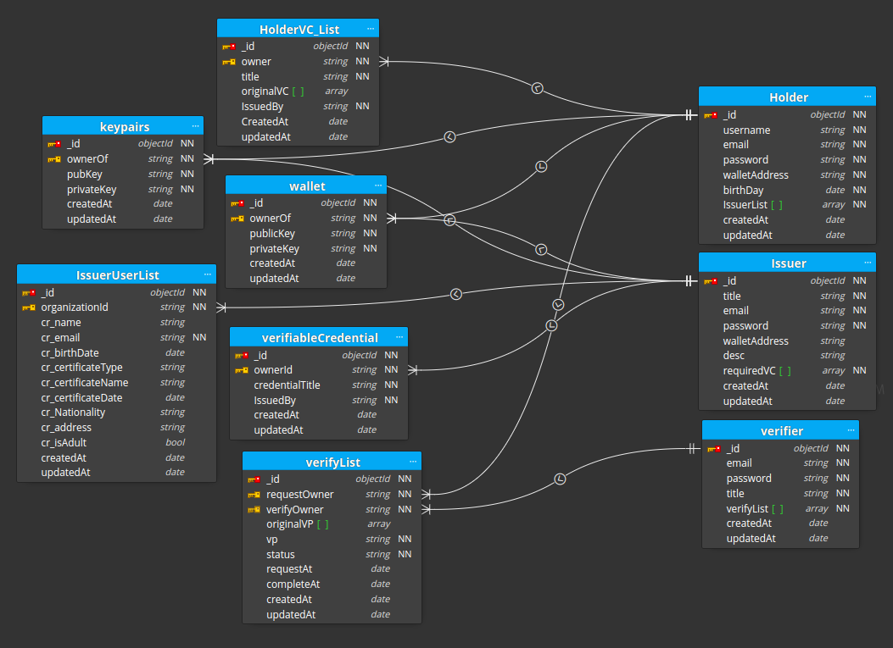
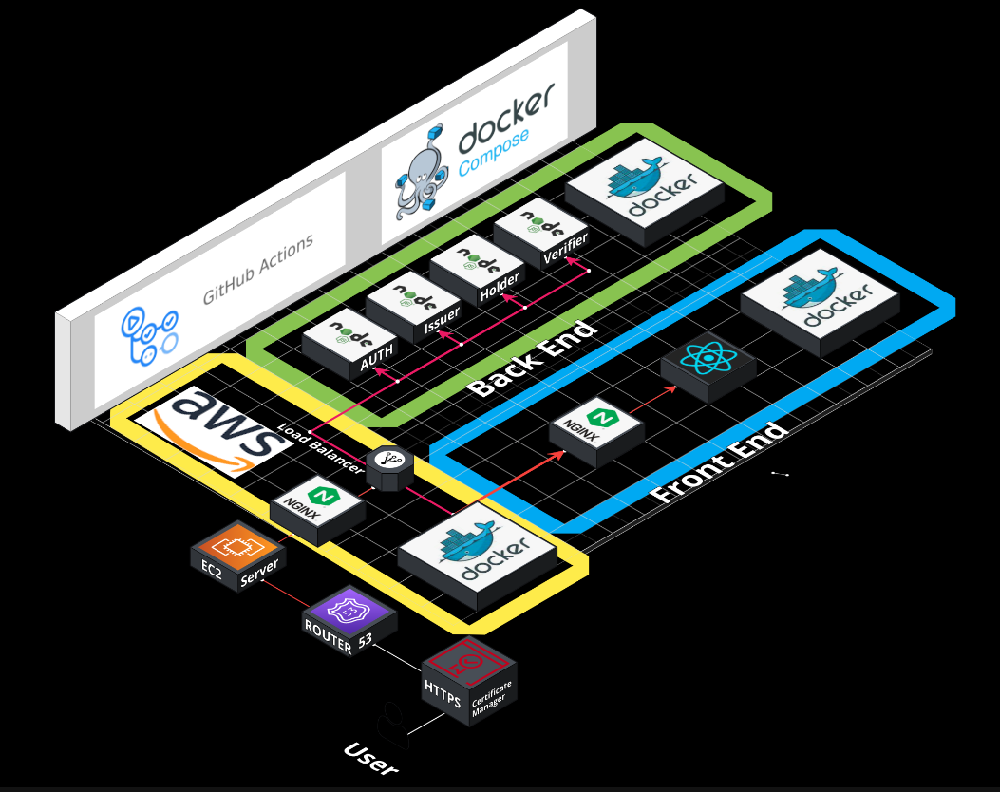
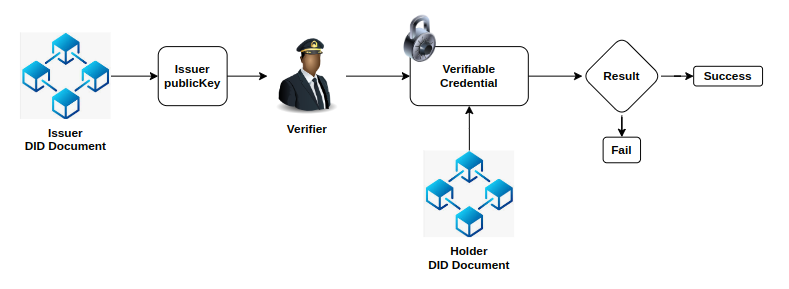

# Back End

## DB Schema

## Micro Service Architecture
  

## Verifier 인증 과정

###  Step #1 Holder 디지털 서명 확인
- `Verifier`는 Holder의 publicKey를 전달받는다.
- `Holder`의 publcKey는 verfiyList DB에서 가져온다.
- `Holder`의 privateKey로 암호화된 VP를 가져온다.
- `Holder`의 암호화된 VP는 verifyList에서 가져온다.
- `Holder`의 publicKey로 함께 전달받은 VP를 검증한다.
- `디지털 서명` 확인에 성공하면 통과

  

### Step #2 Issuer 디지털 서명 확인
- [블록체인] `Holder DID`로 Holder DID Document에서 VC를 가져온다
- [블록체인] `Issuer DID`로 Issuer DID Document에서 Issuer의 publicKey를 가져온다
- `암호화된 VC`를 Issuer의 publicKey로 복호화를 통해 디지털 서명 검증.
- `디지털 서명` 확인에 성공하면 통과

  

### Step #3 올바른 Holder 검증
- `Issuer`가 VC를 발급할 때 `Issuer` DID Document에는 Holder의 정보가 기재됨
- [블록체인] `Issuer`의 DID를 확인 결과 Holder의 정보가 들어있지 않으면 DID 검증 실패
- `Issuer`는 Holder가 가진 VC_Id + title + type, name 4가지 항목으로 검증
- `Issuer` 올바른 Holder가 들어있을 때만 true 반환

  

### Step #4 Verfier가 검증할 항목 일치 여부
- `Verifier` 별로 검증해야 할 검증 항목이 상이하다.
- `졸업증명서`, `성인인증서`, `국적증명서` 등 사전에 지정된 항목 중 하나를 선택할 수 있다.
- `Holder`가 인증요청한 VP의 title이 `Veriifer`의 검증항목과 일치해야 검증에 성공한다.

  